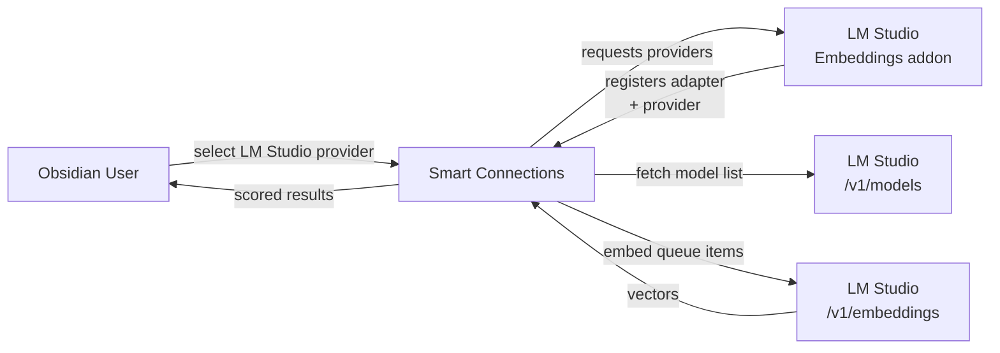

# Smart Connections: LM Studio Embeddings

This addon restores a local embedding option for the excellent **Smart Connections** plugin (https://github.com/brianpetro/obsidian-smart-connections) after a recent refactor slimmed down some built‑in providers. It hooks Smart Connections into **LM Studio’s** OpenAI‑compatible embedding API so you can keep everything on‑device while enjoying the streamlined Smart Connections experience.

## How it works

## Requirements

- LM Studio running locally (default): `http://127.0.0.1:1234`
- LM Studio “Local Server” enabled (OpenAI-compatible API)
- Smart Connections installed and enabled

## Install (manual)

1. `npm install`
2. `npm run build`
3. Copy `main.js` and `manifest.json` into:
   - `.obsidian/plugins/smart-connections-lmstudio-embeddings/`
4. Restart Obsidian and enable the plugin.

## Usage

- Open Smart Connections settings → embedding models.
- Choose Provider: `lmstudio` (or `lm_studio`).
- Pick a model from the dropdown (populated from `GET /v1/models`).
- Click Test.

## Notes

- If Smart Connections caches provider models, you may need to reopen the model modal after changing the LM Studio URL.
- Switching models changes the embedding key; existing items must be (re)embedded for the new key before search results appear.
